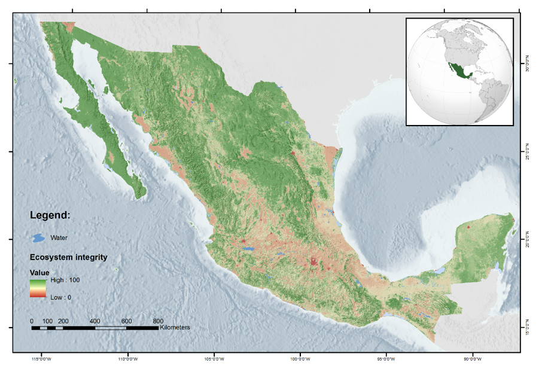

# Integridad ecológica

Esta sección se construyó sobre el trabajo de  Pedro Díaz Maeda, Julián Equihua
Benitez, Miguel Equihua Zamora, Octavio Pérez-Maqueo.

#### ¿Porqué una red para integridad? {-}

## Propuesta vegetación

El primer planteamiento consistió en una red bayesiana con variables de 
vegetación.

### Variables

La red de integridad tiene una variable de interés particular que es el 
[grado de hemerobia](https://es.wikipedia.org/wiki/Hemerobia).

* **Grado de hemerobia**: Utiliza la clasificación de imágenes satelitales 
del año 2004 (INEGI, 2009) con el esperado de vegetación primaria (INEGI, 2003).

Las otras variables que conforman la red de integridad las podemos clasificar
de acuerdo a su origen:

1. **INFyS**: Variables colectadas *in situ* e interpoladas usando bosques 
aleatorios.
    + AlturaTotal_media
    + AlturaTotal_mediana
    + AlturaFusteLimpio_media
    + AlturaFusteLimpio_mediana
    + DiametroCopa_media
    + AlturaTotal_desvest
    + DiametroNormal_media
    + AlturaFusteLimpio_desvest
    + AlturaTotal_desvabs
    + ntree_fixed
    + AlturaFusteLimpio_desvabs
    + DiametroCopa_mediana
    + DiametroNormal_desvest
    + DiametroNormal_desvabs
    + DiametroNormal_mediana
    + DiametroCopa_desvabs
    + DiametroCopa_desvest
    
2. **MODIS**: Productos finales de MODIS.

3. **MAD-Mex**: Clasificación de cobertura de uso de suelos del sistema MAD-Mex.

4. Zonas de vida de Holdridge y mapa digital de elevación de INEGI.

### Red

La estructura de la red se fijó con conocimiento experto, y se llegó a la 
siguiente propuesta.

```{r, warning=FALSE, message=FALSE}
library(tidyverse)
library(here)
library(bnlearn)

netica_bn <- read_rds(here("data", "2019-11-12_vegetation_net.rds"))

netica_bn %>% 
    bn.net() %>% 
    bnviewer::viewer(bayesianNetwork.layout = "layout_with_gem")
```

Propuestas pendientes:

1. Evaluar el score de la red de expertos contra redes con estructura aprendida.

2. Proponer un enfoque híbrido que combine conocimiento experto y datos para
elucidar una nueva estructura (con *black-list*s y *white-list*s y aprendizaje
a partir de datos).

### Exploración de la red

Una vez que tenemos fija la estructura de la red debemos estimar y analizar
las tablas de probabilidad condicional. En el caso de la red anterior se ajustó
usando el *sfotware* [Netica](https://www.norsys.com) y se exportó para poder
leerla en R.

Podemos ver las tablas de probabilidad marginal para cada uno de los nodos en 
la red. Veamos en particular el nodo *delta*.

```{r, message=FALSE, warning=FALSE}
library(gRain)

comp_netica_bn <- compile(as.grain(netica_bn))
delta_marg <- querygrain(comp_netica_bn, nodes = "zz_delt_vp_1")
delta_marg
```

Ahora, podemos ver como cambia el *query* si tenemos evidencia de proporción de
asentamientos *s_0* y estamos en zona de vida 17- Tropical moist forest

```{r}
query_asent <- setEvidence(comp_netica_bn, 
    nodes = c("proporcion_agricultura", "zvh_31"), 
    states = c("s_0_39", "s_3"))
delta_cond <- querygrain(query_asent, nodes = "zz_delt_vp_1")
delta_cond
```

¿qué pasa con delta en distintas ZVH y la misma evidencia de 
agricultura?

```{r, warning=FALSE, message=FALSE}
query_zvh <- function(zvh, node = "proporcion_agricultura", state = "s_0_39"){
    query <- setEvidence(comp_netica_bn, 
        nodes = c(node, "zvh_31"), 
        states = c(state, zvh))
    delta_cond <- querygrain(query, nodes = "zz_delt_vp_1")
    tibble(zvh = zvh, state = parse_number(names(delta_cond[[1]])),  
        delta_cond = delta_cond[[1]])
}

# zvh's ordenadas por tamaño
zvhs <- querygrain(comp_netica_bn, nodes = "zvh_31")[[1]] %>% 
    sort(decreasing = TRUE) %>% 
    names()

# distribución marginal, referencia
delta_marg_df <- tibble(zvh = "s_0", state = extract_numeric(names(delta_marg[[1]])), 
    delta_cond = delta_marg[[1]])

deltas_agri <- map_df(zvhs[1:5], query_zvh)
deltas_agri %>% 
    bind_rows(delta_marg_df) %>% 
    mutate(zvh = factor(parse_number(zvh))) %>% 
    ggplot(aes(x = state, y = delta_cond, color = zvh, group = zvh)) +
    geom_line()
```


```{r}
deltas_bosque <- map_df(zvhs[1:5], ~query_zvh(., node = "proporcion_bosques", 
    state = "s_0"))
deltas_bosque %>% 
    bind_rows(delta_marg_df) %>% 
    mutate(zvh = factor(parse_number(zvh))) %>% 
    ggplot(aes(x = state, y = delta_cond, color = zvh, group = zvh)) +
    geom_line()
```

Observaciones: 

* Muy ruidoso.  
* ¿porqué no hay diferencia ente zvh?


### Mapas




## Ejemplo de ajuste en R

1. Creamos una tabla de datos a partir de los rasters de 2004:

```{r, message=FALSE}
library(tidyverse)
library(bnecology)
library(here)
library(sf)

edos <- c("Yucatan", "Chiapas", "San_Luis_Potosi")
edo_paths <- map_chr(edos, 
    ~here("data", "edos", ., fs::path_ext_set(., "shp")))
# read shapes
edos_train_sf <- read_shps(shp_paths = edo_paths)
plot(st_geometry(edos_train_sf))
```

```{r}
vars_paths_all <- fs::dir_ls(here("data", "rasters_nodes_disc"), glob = "*.tif")
vars_paths_all %>% 
    walk(~print(basename(.)))
```

```{r}
set.seed(957893)
vars_paths <- vars_paths_all[c(2, 4, 6, 10:15, 17, 18, 19)]
net_ex <- fit_bn(edos_train_sf, vars_paths)

net_ex$bn_str %>% 
    bnviewer::viewer(bayesianNetwork.layout = "layout_with_sugiyama")
```

Ahora, ya que tenemos la red ajustada podemos usarla para calcular el índice de
integridad, este se calcula como el valor esperado para el nodo delta 
condicional a los valores observados en el resto de los nodos.

Notemos que podemos calcular el índice en los estados con datos observados pero
también en un nuevo estado, en este caso Quintana Roo y Tabasco.

```{r}
edos_test <- c("Quintana_Roo", "Tabasco")
edo_test_paths <- map_chr(edos_test, ~here("data", "edos", ., 
    fs::path_ext_set(., "shp")))
# read shapes
edos_sf <- read_shps(shp_paths = c(edo_paths, edo_test_paths))

ei_levels <- read_csv(here("data", "rasters_nodes_disc", "zz_delt_vp.csv"), 
    col_names = FALSE, col_types = "c") %>% 
    pull(X1) 

net_ei <- compute_ei(net = net_ex, ei_node = "zz_delt_vp", geom = edos_sf, 
    ei_levels = ei_levels, vars_paths = vars_paths)

glimpse(net_ei$ei_df)
```


La función regresa un raster con el score de integridad de cada pixel.

```{r}
tm_shape(net_ei$raster_ei) + 
    tm_raster("ei_score", style = "cont", palette = "seq", 
        legend.reverse = TRUE) +
    tm_layout(aes.palette = list(seq = "-RdYlGn"), 
        legend.position = c("left","bottom"))
```

También podemos repetir el ejercicio de inferencia que hicimos con la red de 
Nética: 

¿qué pasa con delta en distintas ZVH y la misma evidencia de 
agricultura?

```{r, warning=FALSE, message=FALSE}
query_zvh <- function(zvh, node = "proporcion_agricultura", state = "[0.75,1]"){
    query <- setEvidence(comp_net_ex, nodes = c(node, "zvh_p_hgw"), 
        states = c(state, zvh))
    delta_cond <- querygrain(query, nodes = "zz_delt_vp")
    tibble(zvh = zvh, state = names(delta_cond[[1]]), 
        delta_cond = delta_cond[[1]])
}

# compilamos red ejemplo
comp_net_ex <- compile(as.grain(net_ex$fit))

# zvh's ordenadas por tamaño
zvhs <- querygrain(comp_net_ex, nodes = "zvh_p_hgw")[[1]] %>% 
    sort(decreasing = TRUE) %>% 
    names()

# distribución marginal, referencia
delta_marg <- querygrain(comp_net_ex, nodes = "zz_delt_vp")
delta_marg
delta_marg_df <- tibble(zvh = "0", state = names(delta_marg[[1]]), 
    delta_cond = delta_marg[[1]])

deltas_agri <- map_df(zvhs, query_zvh)
deltas_agri %>% 
    bind_rows(delta_marg_df) %>% 
    mutate(
        zvh = factor(parse_number(zvh)), 
        delta = factor(state, levels = ei_levels)
        ) %>% 
    ggplot(aes(x = delta, y = delta_cond, color = zvh, group = zvh)) +
        geom_line(alpha = 0.8)
```

Vemos un comportamiento más suave y diferencias por zona de humedad.


#### Evaluación de la predicción {-}

Podemos separar predicciones de estados que estuvieron en ajuste.

```{r}
net_ei_train <- compute_ei(net = net_ex, ei_node = "zz_delt_vp", 
    geom = edos_train_sf, ei_levels = ei_levels, vars_paths = vars_paths)

edos_test_sf <- read_shps(shp_paths = edo_test_paths)

net_ei_test <- compute_ei(net = net_ex, ei_node = "zz_delt_vp", 
    geom = edos_test_sf, ei_levels = ei_levels, vars_paths = vars_paths)
```

Matriz de confusión

```{r}
conf_train <- table(as.character(net_ei_train$ei_df$zz_delt_vp),
    net_ei_train$ei_df$ei_class_max)
conf_train
conf_test <- table(as.character(net_ei_test$ei_df$zz_delt_vp),
    net_ei_test$ei_df$ei_class_max)
conf_test
```

Precisión = TP / (TP + FP) 

```{r}
round(100 * prop.table(conf_train, margin = 2))
round(100 * prop.table(conf_test, margin = 2))
```

Recall = TP / (TP + FN)

```{r}
round(100 * prop.table(conf_train, margin = 1))
round(100 * prop.table(conf_test, margin = 1))
```


```{r, fig.height = 3.5}
library(colorspace)

ei_test <- net_ei_test$ei_df %>% 
    add_column(sample = "test")
ei_train <- net_ei_train$ei_df %>% 
    add_column(sample = "train")


ei_all <- ei_test %>% 
    bind_rows(ei_train) %>% 
    drop_na() 

ei_all %>% 
    group_by(sample) %>% 
    sample_n(size = 2000) %>% 
ggplot(aes(x = zz_delt_vp, y = ei_score, 
    color = sample)) +
    theme_minimal() +
    geom_boxplot(outlier.colour = NA,  color = "gray") +
    geom_jitter(alpha = 0.5, height = 0)  +
    ylim(0, 10) + 
    facet_wrap(~sample)
```


En la siguiente figura graficamos para cada pixel, en el eje $x$ la clase 
asignada como más probable, en el eje $y$ el ínide de integridad y el color 
indica la varianza en la distribución del nodo *delta_vp* condicional a la 
evidencia en el resto de los nodos.

Notamos que hay casos en los que la clase más probable es muy diferente al 
*score* de integridad asignado. 

```{r}
library(colorspace)

ei_all %>% 
    group_by(sample, ei_class_max) %>% 
    sample_n(size = 250) %>% 
ggplot(aes(x = ei_class_max, y = ei_score, 
    color = ei_score_var)) +
    scale_color_continuous_sequential() +
    theme_minimal() +
    geom_jitter(alpha = 0.6) +
    facet_wrap(~ sample)
```


