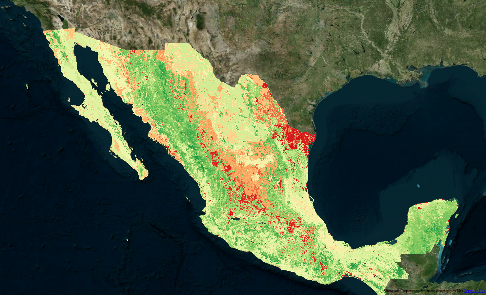
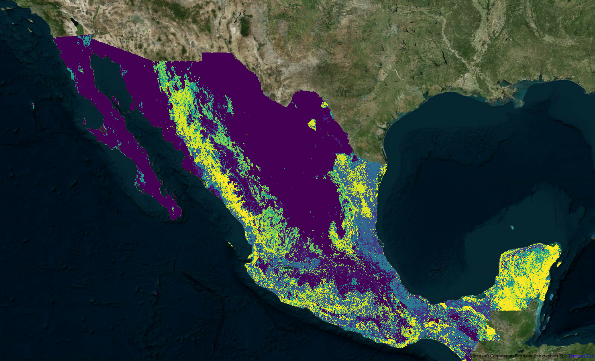

# Fauna

Una de las principales limitantes de la red anterior es que no incluye 
información de fauna. 

Datos disponibles:

* SNIB: Datos de presencia por especie, georreferenciada.

Propuesta: 

Referencias @basile, @barbet y @qiao.

## Consideraciones teóricas

Para incluir registros (sólo-presencia) de fauna en el proceso de modelado de IE con Redes Bayesianas primero se debe acudir a la teoría de modelado de distribución potencial de especies. Los modelos para este propósito se pueden distinguir de acuerdo a sus requerimientos en los datos de entrada @qiao:

* Sólo-presencias (BIOCLIM, ENFA, CONVEXHULL, MVE, KDE y MA)
* Presencias y fondo (GARP y Maxent)
* Presencias y ausencia (GLM, GAM y BRT)

Lo cual, en términos de jerga de aprendizaje de máquina se traduce en:

* Métodos de clasificación de una sola clase
* Métodos de aprendizaje de casos positivos y sin etiqueta (Positive Unlabeled Learning, PU Learning)
* Clasificación supervisada

Dado un problema de clasificación binaria, los métodos de una sola clase son aquellos que se entrenan con base en sólo casos positivos (por ejemplo sólo las presencias de una especie de interés). Esto es común en problemas de detección de valores atípicos. Los métodos de aprendizaje de casos positivos y sin etiqueta sirven para los casos en los que existen casos positivos pero también casos que no se sabe si son positivos o negativos. Clasificación supervisada es el caso en el que tanto casos positivos (e.g. presencias de una especie de interés) y casos negativos (e.g. ausencias) existen para llevar a cabo el entrenamiento de un clasificador.

En nuestro caso para cada especie que quisiéramos incluir en el modelo de integridad ecosistémica, estamos en un contexto en el que no conocemos casos de ausencias pero tenemos a la mano una gran cantidad de datos de fondo. Esto es, píxeles de todo el país de los cuales no sabemos la presencia o ausencia de la especie de interés. 

Nuestra propuesta, tomada de @basile, consta de un método de dos etapas. Como ya se mencionó, nuestro conjunto de entrenamiento consta de observaciones de presencias y in etiqueta $D=P \cup S$. En la primera etapa extraemos un conjunto confiable de ausencias de $S$ y luego llevamos a cabo aprendizaje supervisado clásico. Para esto se utilizan las redes bayesianas como modelos generativos. Ya se vió que una red bayesiana permite modelar distribuciones conjuntas complejas, nosotros vamos a estimar la distribución marginal $P(X|Y=1)$, i.e. sobre sólo los casos de presencia de cada especie. Luego esta distribución marginal permite llevar a cabo inferencia de manera tal que se puedan escoger una conjunto de casos en $S$ que sirvan como ausencias. Sea ${\mathcal G}$ la red ajustada sobre únicamente los casos positivos de una especie de interés, i.e. $P(X|Y=1)$, se puede calular la verosimilitud de cada uno de los píxeles en $S$. Se debe escoger un punto de corte para separar los píxeles candidatos para tomarse como casos negativos (pseudo-ausencias) para la especie objetivo. Una propuesta es el mínimo de las verosimilitudes sobre el conjunto $D$. También se puede tomar un percentil, por ejemplo el $P_{0.05}$ si se cree que las presencias tienen ruido, e.g. que hay avistamientos en lugares que no corresponden al nicho de la especie (cerca de carreteras o poblados). En @barbet se muestra que una muestra aleatoria balancead tomada de las observaciones del fondo tiende a servir bien para entrenar un clasificador supervisado para modelar distribución de especies. En nuestra propuesta tomamos también una muestra aleatoria pero de las observaciones de fondo con una versoimilitud baja estimada a partir de ${\mathcal G}$.

Se debe notar que estas pseudo ausencias se pueden encontrar para múltiples especies y una vez encontradas, los nodos correspondientes a tales especies son de naturaleza binaria. Una red que incluye tales nodos y además uno de integridad ecosistémica permitirá simultáneamente estimar y llevar a cabo inferencia sobre IE y sobre la distribución de las especies de interés.

Como primer caso de estudio se introdujo a una Red Bayesiana variables utilizadas en el primer ejercicio de modelado de IE y también nodos alimentados por registros de Puma, Jaguar y avistamientos de fauna doméstica.

## Insumos

Se debe especificar:

1. La región de análisis: polígonos que determinan que datos se usarán para 
ajustar el modelo. Por ejemplo uno o más estados, o una ecorregión.

2. Las observaciones de fauna: puntos georreferenciados de especies a 
considerar. El código actual considera que varias especies pueden estar 
almacenadas en un mismo archivo shapefile y se ajusta un modelo de manera 
independiente a cada uno.

3. Las variables que conforman la red bayesiana: rasters de variables que 
formarán la red bayesiana, con estructura y probabilidades aprendias del 
subconjunto de datos que coincide con observaciones de cada especie.
Además de variables explicativas **agregamos un identificador a nivel pixel**.

### Región de análisis

En este ejemplo usaremos los polígonos de Yucatán y Chiapas, la función 
`read_shps()` lee los archivos shapefile en el vector de rutas, los reproyecta 
a una proyección dada (por defecto lcc México)
y regresa un objeto *simple feature* con geometría de polígonos, en este
caso omitimos las islas o polígonos no principales asociados a los estados.

```{r, warning=FALSE}
library(bnecology)
library(sf)
library(here)
library(tidyverse)
# paths
yuc_chis_paths <- map_chr(c("Yucatan", "Chiapas"), 
    ~here("data", "edos", ., fs::path_ext_set(., "shp")))
# read shapes
yuc_chis <- read_shps(shp_paths = yuc_chis_paths)
plot(st_geometry(yuc_chis))
```

### Observaciones fauna

La función `read_shps_points()` lee uno o más shapefiles de puntos, reproyecta 
a una proyección dada (por defecto lcc México), y regresa un objeto de tipo
*simple feature* con geometría de puntos. Opcionalmente permite filtrar por el
valor de una variable. Si se desa filtrar por más de una variable se puede hacer 
por fuera de la función.

```{r}
fauna_path <- here("data", "vectors_nodes", "fauna_shapefile_20190814.shp")
fauna <- read_shps_points(fauna_path, filter_var = fchclct, 
    filter_values = 2009:2019)
fauna_gatos <- fauna %>% 
    filter(espcvld %in% c("Panthera onca", "Puma concolor"))
glimpse(fauna_gatos)
```

### Variables red bayesiana

Elegimos un subconjunto de variables disponibles y el raster de ids:

```{r}
covs_paths_all <- fs::dir_ls(here("data", "rasters_nodes_disc"), glob = "*.tif")
covs_paths_all %>% 
    basename()
```

```{r}
covs_paths <- covs_paths_all[c(2, 4, 6, 10:15, 17, 18, 19)]
```

### Ajustar redes

Debe incluirse el raster con identificadores de pixel, cuyo nombre debe incluir
"id".

```{r, message=FALSE, warning=FALSE}
fit_yuc_chis <- fit_bn_fauna(fauna_geom = fauna_gatos, species_var = espcvld, 
    geom = yuc_chis, covs_paths = covs_paths)

library(bnlearn)
yuc_chis_puma <- fit_yuc_chis[["Puma concolor"]]
plot(yuc_chis_puma$bn_str)
```


### Test in different area


```{r, warning=FALSE, message=FALSE}
q_roo_path <- here("data", "edos", "Quintana_Roo", "Quintana_Roo.shp")
q_roo <- read_shps(shp_paths = q_roo_path)

test_q_roo <- test_bn_fauna(fit_yuc_chis, fauna_geom = fauna_gatos, 
    species_var = espcvld, geom = q_roo, covs_paths = covs_paths) 

test_q_roo
```


### Primeros mapas de IE con fauna

Como se mencionó esta red bayesiana permite estimar IE y a la par las distribuciones de las especies contempladas (Puma, Jaguar, Vacas). 

A continuación presentamos estos resultados.




